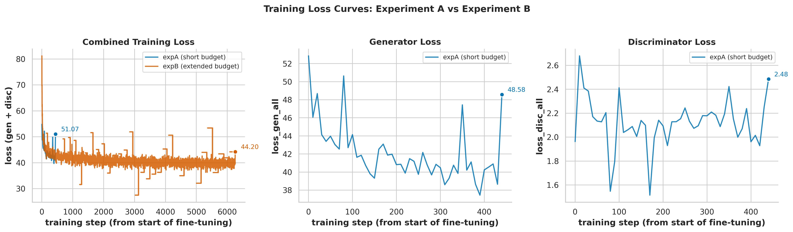
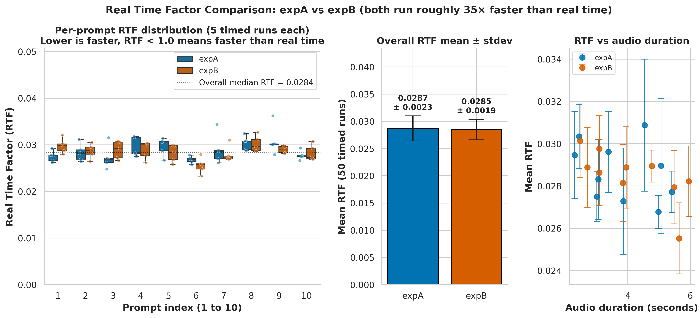

# Single-Speaker Text-to-Speech Fine-Tuning

A small project where I fine-tune the open-source [Piper](https://github.com/rhasspy/piper) Amy Medium voice model on a 1500 utterance subset of the [LJSpeech](https://keithito.com/LJ-Speech-Dataset/) dataset to study how training budget affects the quality of single-speaker speech adaptation.

The pipeline is end-to-end: text comes in, a playable `.wav` comes out. Two controlled fine-tuning runs are compared (a short 6 epoch run against a longer 35 epoch run) and evaluated with both objective metrics (Real Time Factor, training loss convergence) and qualitative listening samples.

---

## Highlights

- **End-to-end VITS-based TTS** running locally on a single laptop GPU
- **Reproducible** with a fixed seed, YAML configs, and a deterministic dataset subset
- **Modern stack** PyTorch 2.6 + CUDA 12.4 + PyTorch Lightning 2.4 (with one targeted compatibility patch to Piper's Lightning 1.x training code)
- **Lightweight inference** at roughly RTF 0.029 on CPU, around 35x faster than real time
- **20 generated audio samples** comparing the two fine-tuned voices side by side

---

## Sample output

### Training loss curves

The combined training loss reduces from approximately 81 down to 44 over the longer run, while the short budget run plateaus quickly around 50. Both follow the expected VITS adversarial pattern of decreasing generator loss with mildly increasing discriminator loss.



### Real Time Factor comparison

Both fine-tuned models synthesise audio about 35x faster than real time. Training budget changes parameter values but not parameter count, so inference speed stays effectively unchanged. The chart below shows the per-prompt distribution, the headline mean ± stdev, and how speed varies with audio duration.



---

## System architecture

> _Architecture diagram coming soon. Will be drawn in Excalidraw and embedded here._

<br>
<br>

## Inference sequence

> _Sequence diagram coming soon. Will be drawn in Excalidraw and embedded here._

<br>
<br>

---

## Tech stack

| Layer | Component |
|---|---|
| Acoustic model | [Piper TTS](https://github.com/rhasspy/piper) (VITS-based, single-speaker) |
| Base voice | Amy Medium (Piper Voices, fine-tuned on a non-LJSpeech speaker) |
| Phonemizer | [eSpeak NG](https://github.com/espeak-ng/espeak-ng) via `piper_phonemize` |
| Deep learning | PyTorch 2.6.0 + CUDA 12.4 |
| Trainer | PyTorch Lightning 2.4.0 (with a small compatibility patch on Piper) |
| Inference runtime | ONNX Runtime 1.23 |
| Audio I/O | librosa, soundfile |
| Visualisation | matplotlib + seaborn for static plots, plotly for interactive |
| Notebook | Jupyter |

## Hardware used

| | |
|---|---|
| GPU | NVIDIA GeForce RTX 4060 Laptop (8 GB VRAM, driver 591.86) |
| CPU | Intel Core i7 13th generation |
| RAM | 32 GB |
| Storage | About 12 GB used (dataset, base checkpoint, two fine-tuned checkpoints) |
| OS | Ubuntu 22.04 inside WSL2 on Windows 11 |

The project also runs on native Linux and on Mac (CPU-only) with minor adjustments described below.

---

## Project layout

```
.
├── notebook/
│   └── Group41_A3_code.ipynb     The main notebook, end-to-end story
├── scripts/
│   ├── common.py                 Shared classes and helpers
│   ├── prepare_subset.py         Builds the 1500 sample LJSpeech subset
│   ├── train.py                  Fine-tuning entry point (wraps Piper)
│   ├── synth.py                  Single text-to-WAV entry point
│   ├── evaluate.py               Real Time Factor measurement protocol
│   ├── export_checkpoint.py      Lightning .ckpt to .onnx conversion
│   └── test_prompts.txt          The 10 prompts used for samples
├── configs/
│   ├── expA.yaml                 Short training budget (~500 steps)
│   └── expB.yaml                 Extended training budget (~3000 steps)
├── piper/                        Piper source (cloned), with our patch applied
├── wav_examples/                 Generated WAV files (20 samples total)
├── results/                      Metrics tables, figures, spectrograms
├── checkpoints/                  Base + fine-tuned model files
├── logs/                         Raw training logs and Lightning logs
├── requirements.txt              Python dependency pins
└── README.md                     This file
```

---

## Setup and install

The instructions below assume a fresh machine with Python 3.10 available. The same Python codebase runs on Linux, Windows (via WSL2), and Mac, but the system-level commands differ. Pick the section that matches your machine.

> **A note on GPUs.** Training the longer run from scratch on a CPU is impractical (days). The short run is feasible on a CPU in a few hours. Inference (synthesis) runs at faster-than-real-time on any modern CPU and does not need a GPU.

---

### Linux setup (recommended)

Tested on Ubuntu 22.04 with an NVIDIA RTX 4060 Laptop GPU.

**Step 1: System packages.**

```bash
sudo apt update
sudo apt install -y python3 python3-pip python3-venv python3-dev build-essential \
                    git ffmpeg espeak-ng libsndfile1
```

**Step 2: Create a Python virtual environment.**

```bash
python3 -m venv venv
source venv/bin/activate
pip install --upgrade pip setuptools wheel
```

**Step 3: Install PyTorch with CUDA support.**

```bash
pip install torch==2.6.0 torchaudio==2.6.0 --index-url https://download.pytorch.org/whl/cu124
```

If you do not have an NVIDIA GPU, install the CPU-only build instead:

```bash
pip install torch==2.6.0 torchaudio==2.6.0
```

**Step 4: Install the rest of the Python packages.**

```bash
pip install -r requirements.txt
```

**Step 5: Set up Piper.**

This single script clones Piper at the exact commit this project was developed against, applies the two compatibility patches described in `PATCHES.md`, compiles the Cython helper, and installs the package:

```bash
bash setup_piper.sh
```

**Step 6: Verify the install.**

```bash
python -c "import torch; print('CUDA available:', torch.cuda.is_available())"
python -c "from piper_train.vits.monotonic_align import maximum_path; print('Piper OK')"
```

Both should print success messages with no errors.

---

### Windows setup (via WSL2)

The cleanest way to run this on Windows is through WSL2 with Ubuntu, because most ML tooling assumes a Linux environment and Windows-native CUDA builds of PyTorch are less battle-tested.

**Step 1: Install WSL2 and Ubuntu.**

In an admin PowerShell window:

```powershell
wsl --install -d Ubuntu-22.04
```

Reboot if prompted, then complete the Ubuntu first-time setup (pick a username and password).

**Step 2: Install the NVIDIA driver on Windows.**

Download and install the latest [NVIDIA GeForce driver](https://www.nvidia.com/Download/index.aspx) for your card. WSL2 will see the GPU through this driver; you do not install CUDA inside Ubuntu separately.

**Step 3: Open Ubuntu and follow the Linux instructions above** starting from Step 1.

Verify the GPU is visible from inside Ubuntu:

```bash
nvidia-smi
```

---

### Mac setup (CPU-only)

Tested in principle on Apple Silicon. Training the longer run on a Mac is not recommended; use the short config or run inference only.

**Step 1: Install Homebrew packages.**

```bash
brew install python@3.10 espeak-ng ffmpeg libsndfile
```

**Step 2: Create a virtual environment.**

```bash
python3.10 -m venv venv
source venv/bin/activate
pip install --upgrade pip setuptools wheel
```

**Step 3: Install PyTorch (CPU build).**

```bash
pip install torch==2.6.0 torchaudio==2.6.0
```

Apple Silicon Macs can optionally use MPS acceleration, but Piper's training code has known issues with MPS in 2026, so CPU is the reliable path.

**Step 4: Continue with steps 4 through 6 from the Linux instructions.**

---

## Download the dataset and base voice

These two downloads sit outside the repository because they are too large to ship. Both are public and free.

**LJSpeech dataset** (about 2.6 GB, 24 hours of single-speaker English audiobook readings):

```bash
mkdir -p data
cd data
wget https://data.keithito.com/data/speech/LJSpeech-1.1.tar.bz2
tar -xjf LJSpeech-1.1.tar.bz2
rm LJSpeech-1.1.tar.bz2
cd ..
```

**Amy Medium base checkpoint and config** (about 800 MB Lightning checkpoint plus a 5 KB JSON config):

```bash
mkdir -p checkpoints
cd checkpoints
wget "https://huggingface.co/datasets/rhasspy/piper-checkpoints/resolve/main/en/en_US/amy/medium/epoch%3D6679-step%3D1554200.ckpt"
mv 'epoch=6679-step=1554200.ckpt' amy_medium_base.ckpt
wget https://huggingface.co/rhasspy/piper-voices/resolve/main/en/en_US/amy/medium/en_US-amy-medium.onnx.json
cd ..
```

---

## How to run the pipeline

Once the install is done and both downloads are in place, the full pipeline runs in five commands.

**Step 1: Build the deterministic 1500 utterance subset.**

```bash
python scripts/prepare_subset.py
```

This selects the same 1500 utterances every time (seed 42) and splits them 90 / 5 / 5 into train, validation, and test lists under `data/lj_subset/`.

**Step 2: Pre-process the subset for Piper.**

```bash
python -m piper_train.preprocess \
    --language en-us \
    --input-dir data/lj_subset \
    --output-dir data/lj_subset_processed \
    --dataset-format ljspeech \
    --single-speaker \
    --sample-rate 22050 \
    --max-workers 6
```

About 5 minutes on the recommended hardware.

**Step 3: Run the two fine-tuning experiments.**

```bash
python scripts/train.py --config configs/expA.yaml
python scripts/train.py --config configs/expB.yaml
```

Experiment A takes about 20 minutes on the recommended hardware. Experiment B takes around 4 hours on a laptop GPU because of thermal throttling on long sustained loads.

**Step 4: Open the notebook and run all cells.**

```bash
jupyter notebook notebook/Group41_A3_code.ipynb
```

Select the kernel called **Python (TTS Assignment)**, then click **Run All**. The notebook will export each fine-tuned checkpoint to ONNX, synthesise 10 sample WAVs per experiment, measure Real Time Factor with five timed runs per prompt, and produce every figure under `results/figures/`.

**Step 5: Run inference on arbitrary text.**

```bash
python scripts/synth.py \
    --model checkpoints/expB/model.onnx \
    --config checkpoints/expB/config.json \
    --text "Hello world, this is the trained voice speaking." \
    --out wav_examples/hello.wav
```

---

## What the experiments compare

Both runs share the same dataset split, the same random seed, the same batch size, and the same Amy Medium base checkpoint. The only difference is the training budget.

| | Experiment A | Experiment B |
|---|---|---|
| Description | Short budget baseline | Extended budget |
| Max epochs | 6 | 35 |
| Approximate training steps | 500 | 3000 |
| Wall clock time on RTX 4060 | ~20 min | ~4 h |
| Final combined train loss | ~51 | ~44 |
| Real Time Factor on CPU | ~0.0287 | ~0.0285 |

The question being answered is: how much does training budget matter for adapting a pretrained TTS voice to a new single speaker, and does it have any inference-side cost?

The headline finding is that a longer run does reduce training loss meaningfully (about 14 percent lower combined loss) but has essentially zero effect on inference speed, since both fine-tuned models share the same architecture and parameter count. The trade-off is therefore quality versus training time, not quality versus inference time.

---

## Reproducibility notes

- **Seed.** Every script begins with `common.set_all_seeds(42)`, which seeds Python's `random`, NumPy, PyTorch (CPU and CUDA), and `PYTHONHASHSEED`.
- **Subset.** The 1500 utterance selection is deterministic given the seed, so anyone running `prepare_subset.py` gets exactly the same audio files.
- **Configurations.** Every hyperparameter lives in the YAML files under `configs/`, so an experiment can be tweaked by changing one line of text.
- **Patches.** Piper's training code targets PyTorch Lightning 1.x. To run on Lightning 2.4 we apply two small patches: a rewrite of `piper_train/__main__.py` to replace the removed `Trainer.add_argparse_args` method, and a manual-optimization rewrite of `training_step` in `piper_train/vits/lightning.py` because Lightning 2.x removed automatic alternating between multiple optimizers. Both patches are checked in and applied in place. For the full diff and rationale, see `PATCHES.md` at the project root.
- **Per-step metrics.** Every step's loss is saved both in Piper's CSV logger and in our own parsed CSV under `results/`, so the loss curves can be reproduced without re-running training.

---

## Credits and references

- [Piper TTS](https://github.com/rhasspy/piper) by Michael Hansen, the VITS-based TTS toolkit this project fine-tunes.
- [LJSpeech 1.1](https://keithito.com/LJ-Speech-Dataset/) by Keith Ito and Linda Johnson, the single-speaker English corpus used here.
- [VITS](https://arxiv.org/abs/2106.06103): Kim, J., Kong, J., & Son, J. (2021). Conditional variational autoencoder with adversarial learning for end-to-end text-to-speech. _ICML 2021_.
- [eSpeak NG](https://github.com/espeak-ng/espeak-ng) for grapheme-to-phoneme conversion.
- PyTorch, PyTorch Lightning, Hugging Face datasets, ONNX Runtime, librosa, soundfile, matplotlib, seaborn, plotly.
